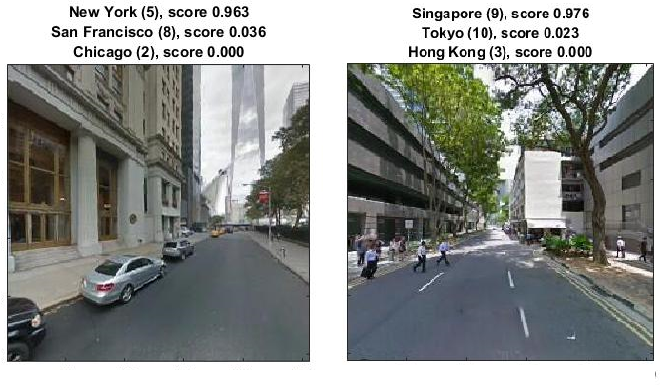

# cv_streetview

_Code repository for deep learning urban visual characteristics analysis_

## Overview

The goal of this research project is to evaluate how well cities/districts can be characterized by their visual properties 
using the readily available city imaginary data set provided by Google street view. 

In order to find out the image features that would affect a deep learning algorithm to distinguish between different cities, 
we trained several **image categorization neural networks** using AlexNet and VGG-S CNN structures, 
and analyzed the visual clues that helps the algorithm make categorization decisions. 
We found out that the algorithm precisely grasps the differences between different city types, 
and has almost **92% accuracy** for the best model. 

As an exploration of latent urban characteristics that can be reflected in the visual aspect, 
the research proposes an alternative paradigm of computational urban morphological research 
where environmental affordances revealed in streetlevel urban imagery are taken into consideration.

## Dataset

About 160,000 images were requested using Googole Streetview API (data requesting code [here](scripts/getting_data.ipynb)). Samples of the dataset can be found in the ["data"](data/) folder. 2/3 of the images were used for training, 1/6 for validating, and 1/6 for testing.

## Demo

The project is built within [MatConvNet](http://www.vlfeat.org/matconvnet/) framework. To run the demo, please 

1. Clone the repository.

2. Follow this [guide](http://www.vlfeat.org/matconvnet/install/) to install MatConvNet. 

3. Download the trained model from [here](https://dl.dropboxusercontent.com/u/41547286/net-epoch-60.mat)

4. Run `matconvnet/examples/run_city_demo.m` to predict the the city of a given image (make sure you change the paths of the trained model as well as the image to point to the model you just downloaded and the image you want to test).

## Work in progress

This project is a work in progress and you can find the latest updates in visual feature extraction and analysis mainly in the [`scripts/` folder](scripts/). 